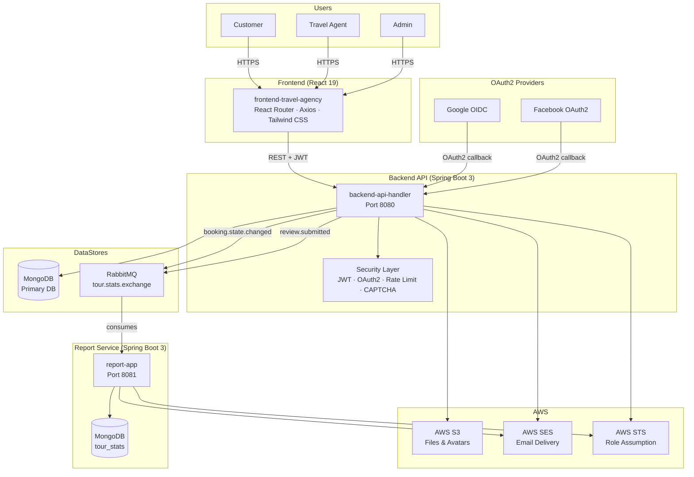
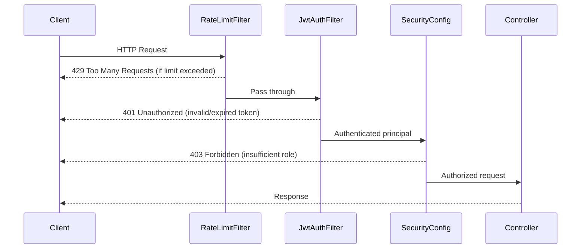
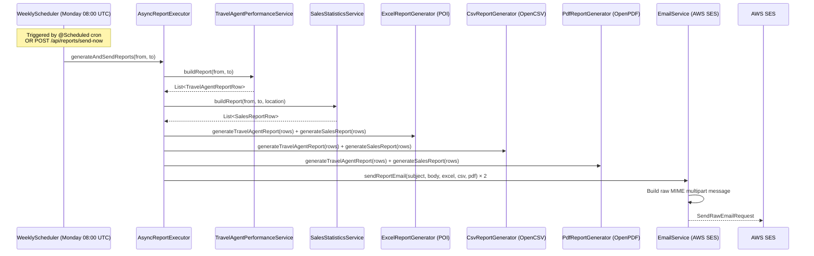
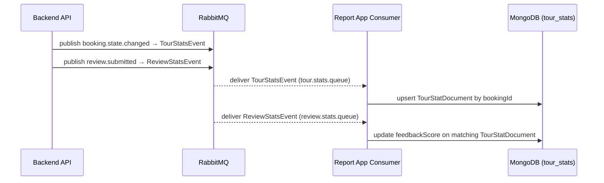
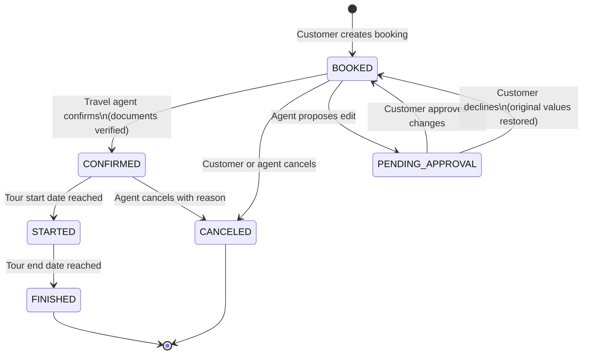

# 🌍 Travel Agency Platform

A full-stack travel booking and management platform built with **Spring Boot 3**, **React 19**, **MongoDB**, **RabbitMQ**, and **AWS**. The platform supports the complete journey from tour discovery and booking through document management, travel agent coordination, and automated reporting — all secured with JWT, OAuth2, rate limiting, and role-based access control.

---

## Table of Contents

- [Project Overview](#project-overview)
- [Architecture](#architecture)
- [Features](#features)
- [Technology Stack](#technology-stack)
- [Module Breakdown](#module-breakdown)
- [Authentication & Security](#authentication--security)
- [API Overview](#api-overview)
- [Database Overview](#database-overview)
- [Reporting Flow](#reporting-flow)
- [Booking Workflow](#booking-workflow)
- [Local Setup](#local-setup)
- [Environment Variables](#environment-variables)
- [Testing](#testing)
- [Key Technical Highlights](#key-technical-highlights)
- [My Contributions](#my-contributions)
- [Future Improvements](#future-improvements)
- [Repository Structure](#repository-structure)
- [Screenshots](#screenshots)
- [License](#license)

---

## Project Overview

Travel agencies face fragmented tooling: customers book tours through one channel, travel agents manage bookings through another, and analytics live in spreadsheets. This platform unifies all three into a single, event-driven system.

**Primary users:**

| Role | Description |
|---|---|
| **Customer** | Browses and books tours, uploads travel documents, tracks booking status, leaves reviews |
| **Travel Agent** | Manages assigned bookings, verifies documents, confirms and cancels bookings, proposes changes |
| **Admin** | Moderates reviews, generates and downloads performance reports, accesses all system data |

**Core business capabilities:**

- Tour discovery with destination autocomplete, multi-criteria filtering, and paginated results
- Multi-step booking lifecycle with document upload and agent-customer change approval
- Event-driven reporting via RabbitMQ that aggregates booking and review data into weekly PDF, Excel, and CSV reports delivered by email
- Secure authentication supporting local email/password with OTP verification and Google OAuth2 social login

---

## Architecture

### System Interaction

```
Customer / Admin / Travel Agent
         │
         ▼
┌─────────────────────────┐
│  React 19 Frontend       │  ← JWT in localStorage, refresh token in HttpOnly cookie
│  (frontend-travel-agency)│    Axios interceptors auto-refresh on 401
└──────────┬──────────────┘
           │ REST / HTTPS
           ▼
┌─────────────────────────┐      ┌─────────────┐
│  Spring Boot API         │─────▶│   MongoDB   │  ← users, tours, tour_instances,
│  (backend-api-handler)   │      │             │     bookings, reviews, travel_agents
│  Port 8080               │      └─────────────┘
│                          │
│  On booking/review event │      ┌─────────────┐
│  publishes message ──────┼─────▶│  RabbitMQ   │
└──────────────────────────┘      │  (AMQP)     │
                                  └──────┬──────┘
                                         │ consumes
                                         ▼
                            ┌────────────────────────┐      ┌─────────────┐
                            │  Spring Boot Report App  │─────▶│   MongoDB   │ ← tour_stats
                            │  (report-app)            │      └─────────────┘
                            │  Port 8081               │
                            │  Generates PDF/Excel/CSV │─────▶  AWS SES
                            │  Weekly cron: Mon 08:00  │       (email delivery)
                            └────────────────────────┘
                                         │
                            ┌────────────┴────────────┐
                            │      AWS Services        │
                            │  S3  – avatar & document │
                            │       storage            │
                            │  SES – transactional     │
                            │        email             │
                            │  STS – role assumption   │
                            └─────────────────────────┘
```

### Mermaid Architecture Diagram



---

## Features

### Authentication & Account Management

- **3-step email-verified registration** — email uniqueness check → OTP sent via AWS SES → password set and account created
- **JWT authentication** with RS256-signed access tokens (15 min) and rotating refresh tokens (7 days) stored in `HttpOnly` cookies
- **Google OAuth2 / OIDC social login** with onboarding flow for first-time users
- **Password recovery** — 6-digit OTP sent to registered email, non-enumerating response
- **CAPTCHA** — custom image-based challenge with server-side Caffeine cache and TTL expiry
- **Account locking** — accounts lock for 15 minutes after 5 consecutive failed login attempts
- **Email change** — token-based confirmation flow via email link
- **Role-based access control** — `CUSTOMER`, `TRAVEL_AGENT`, `ADMIN` roles enforced at the filter chain level

### Tour Management

- Paginated tour listing with multi-criteria filtering: destination, start date, duration, adults, children, meal plan, tour type, sort order
- Destination autocomplete endpoint for search input
- Full tour detail page including hotel info, pricing, and guest quantity constraints
- Tour types: `RESORT`, `CRUISE`, `HIKE`
- Meal plans: `BB`, `HB`, `FB`, `AI`
- Sort options: `RATING_DESC`, `RATING_ASC`, `PRICE_DESC`, `PRICE_ASC`, `NEWEST`, `OLDEST`
- Separate `TourInstance` collection for date-specific availability and pricing (decoupled from static tour metadata)

### Booking Management

- **Full booking lifecycle** with optimistic locking (`@Version`) to prevent concurrent update conflicts
- Booking states: `BOOKED → CONFIRMED → STARTED → FINISHED / CANCELED`
- Customer can create, update, and cancel bookings
- Travel agent can confirm (with or without document check), cancel with structured reason, and propose booking edits
- **Agent edit approval workflow** — customer approves or declines agent-proposed changes offline; original values snapshotted for rollback on decline
- Booking cancellation policy: configurable free-cancellation window per tour

### Document Management

- Customers upload travel documents (passports, payment receipts) as structured records per booking
- Documents stored with metadata; individual update and delete supported
- Travel agents review and verify each document (approve/reject) before confirming a booking
- Document retrieval accessible to both customers and assigned agents

### Review & Feedback System

- Customers submit star-rated reviews after completed bookings (one review per user per tour, enforced with compound unique index)
- Reviews contain rating, text content, and author metadata
- Review events published to RabbitMQ on submission to update reporting statistics
- **Caffeine cache** on review queries (500 entries, 5-minute TTL) for high-read performance

### Admin Capabilities

- Review moderation — list all reviews with filters (rating, tour type, visibility, flagged status); set visibility to `PUBLISHED` or `HIDDEN`
- Report generation dashboard — select report type, date range, and location; view tabular data in-browser
- Download reports in Excel, CSV, or PDF format
- Trigger manual weekly report email from the admin interface

### Travel Agent Features

- Dashboard listing all assigned bookings with optional status filter
- Full booking detail view including customer documents and lifecycle history
- Document verification workflow per booking
- Structured booking cancellation with refund eligibility tracking
- Propose and record customer approval for booking amendments

### Reporting & Email Delivery

- **Travel Agent Performance Report** — tours sold, delta vs previous period, average/minimum feedback, revenue, delta revenue
- **Sales Statistics Report** — per-tour breakdown including country, city, tours sold, feedback, revenue with period-over-period deltas
- Reports generated in Excel (Apache POI 5.3.0), CSV (OpenCSV 5.9), and PDF (OpenPDF 1.3.43)
- Automated weekly dispatch every Monday at 08:00 UTC via `WeeklyReportScheduler`
- Manual trigger via `POST /api/reports/send-now` for on-demand delivery
- Multi-attachment emails sent via AWS SES raw message API (Excel + CSV + PDF in one message)
- Report service consumes two RabbitMQ queues: booking state changes and review submissions

### File Storage

- Profile avatars uploaded as Base64 and stored in **AWS S3**
- Booking documents referenced and managed through S3

### Observability

- Spring Boot Actuator with health, metrics, and Prometheus endpoints
- Micrometer metrics including a dedicated `auth.ratelimit.exceeded.count` counter
- Structured logging throughout all service layers

---

## Technology Stack

| Layer | Technology |
|---|---|
| **Frontend** | React 19, React Router DOM 7, Axios, Tailwind CSS 3.4 |
| **Backend** | Spring Boot 3.3.5, Java 17, Spring Security, Spring Data MongoDB |
| **Authentication** | JJWT 0.12.5 (RS256), Spring OAuth2 Client (Google OIDC, Facebook) |
| **Database** | MongoDB (primary), Spring Data MongoDB repositories |
| **Messaging** | RabbitMQ (AMQP), Spring AMQP, `TopicExchange` with two queues |
| **Rate Limiting** | Bucket4j 8.10.1, Caffeine cache |
| **Resilience** | Resilience4j 2.2.0 |
| **File Storage** | AWS SDK v2 — S3 |
| **Email** | AWS SDK v2 — SES (raw message API via STS AssumeRole) |
| **Credential Management** | AWS SDK v2 — STS AssumeRole pattern |
| **In-Memory Cache** | Caffeine (review cache, rate-limit bucket cache, CAPTCHA cache) |
| **Report Generation** | Apache POI 5.3.0 (Excel), OpenCSV 5.9 (CSV), OpenPDF 1.3.43 (PDF) |
| **API Documentation** | SpringDoc OpenAPI 2.1.0 / Swagger UI |
| **Validation** | Spring Bean Validation (Jakarta), custom `@PasswordConstraint` |
| **Observability** | Spring Boot Actuator, Micrometer, Prometheus |
| **Build** | Maven, Spring Boot Maven Plugin, JaCoCo |
| **Containerization** | Docker (OpenJDK 22 base image) |
| **Orchestration** | Helm 3 (Kubernetes), HPA, Ingress, ServiceAccount templates |
| **Testing** | JUnit 5, Spring Boot Test, Spring Security Test, Testcontainers, Embedded MongoDB (Flapdoodle), Awaitility |

---

## Module Breakdown

### `backend-api-handler`

The central API service handling all business logic, data persistence, and external integrations.

**Responsibilities:**

- Exposes the full REST API consumed by the frontend
- Enforces authentication and authorization on every protected route
- Publishes booking and review domain events to RabbitMQ
- Integrates with AWS S3 for file storage and AWS SES for transactional email
- Manages the complete booking lifecycle with state machine transitions

**Major Controllers:**

| Controller | Base Path | Responsibility |
|---|---|---|
| `AuthController` | `/api/v1/auth` | Sign-up, sign-in, refresh, logout, password recovery, 3-step registration, OAuth2 complete-signup |
| `TourController` | `/api/v1/tours` | Destination search, tour listing, tour detail, reviews, feedback submission |
| `BookingController` | `/api/v1/bookings` | Full booking lifecycle, document management, agent-customer change approval |
| `TravelAgentController` | `/api/v1/travel-agent` | Agent booking list, booking detail, document access |
| `AdminReviewController` | `/api/v1/admin/reviews` | Review moderation (list, filter, set visibility) |
| `UserController` | `/api/v1/users` | Profile get/update, avatar upload, password change, email change |
| `CaptchaController` | `/api/v1/auth/captcha` | CAPTCHA image generation |

**Security Implementation:**

- `JwtAuthenticationFilter` — validates RS256-signed access tokens on every protected request
- `RateLimitFilter` — Bucket4j per-IP token bucket; applied to sign-in, sign-up, and user email/password endpoints
- `SecurityConfig` — stateless session policy, CORS configuration, role-based path authorization
- `BCryptPasswordEncoder` with strength 12
- `CookieOAuth2AuthorizationRequestRepository` — persists OAuth2 state in cookies to maintain stateless architecture
- `CustomOidcUserService` / `CustomOAuth2UserService` — handles Google OIDC and Facebook OAuth2 user mapping

**Key Packages:**

```
com.epam.edp.demo
├── captcha/          Custom image CAPTCHA (entry model)
├── config/           AWS, Cache, JWT, RabbitMQ, Security, Web, OpenAPI, Tomcat
├── controller/       REST controllers
├── dto/              Request/response DTOs (auth, booking, tour, user, admin)
├── entity/           MongoDB documents (User, Booking, Tour, TourInstance, Review, TravelAgent, ...)
├── enums/            BookingStatus, TourType, MealPlan
├── exception/        Domain exceptions + GlobalExceptionHandler
├── mapper/           DTO ↔ entity mappers
├── oauth2/           OAuth2 success/failure handlers, onboarding token service
├── repository/       Spring Data MongoDB repositories
├── security/         JwtAuthenticationFilter, RateLimitFilter, JwtTokenProvider
├── service/          Business logic (Auth, Booking, BookingDocument, Tour, User, ...)
└── util/             Security utils, date utils, password validator
```

---

### `frontend-travel-agency`

A single-page React application providing the customer, travel agent, and admin interfaces.

**Pages:**

| Page | Route | Access |
|---|---|---|
| Login | `/login` | Public |
| Registration | `/register` | Public |
| Forgot Password | `/forgot-password` | Public |
| Reset Password | `/reset-password` | Public |
| OAuth Redirect | `/oauth2/redirect` | Public |
| OAuth Signup | `/oauth2/signup` | Public |
| Tours | `/tours` | Authenticated |
| Tour Detail | `/tours/:tourId` | Authenticated |
| My Tours (Bookings) | `/tours` (tab) | Customer |
| Profile | `/profile` | Authenticated |
| Confirm Email | `/profile/confirm-email` | Authenticated |
| Agent Bookings | `/agent/bookings` | Travel Agent |
| Admin Reports | `/admin/reports` | Admin |
| Admin Feedback | `/admin/feedback` | Admin |
| Destinations | `/destinations` | Authenticated |
| Packages | `/packages` | Authenticated |
| Contact | `/contact` | Authenticated |

**Authentication Flow:**

1. User submits credentials → `POST /api/v1/auth/sign-in`
2. Access token stored in `localStorage`; refresh token set in `HttpOnly` cookie by server
3. `AuthContext` holds user state (role, name, email, userId decoded from JWT)
4. Axios request interceptor attaches `Authorization: Bearer <token>` to all requests
5. Axios response interceptor intercepts `401` → calls `/api/v1/auth/refresh` once (shared promise prevents concurrent refresh storms) → replays original request
6. On logout, server invalidates refresh token; localStorage is cleared; user is redirected

**State Management:** React Context (`AuthContext`) for authentication state; component-level `useState`/`useCallback` for UI state.

**Key Services (`src/services/`):**

| Service | Purpose |
|---|---|
| `api.jsx` | Axios instance with token interceptors and auto-refresh |
| `authService.jsx` | Sign-in, sign-out, registration flows |
| `bookingService.jsx` | Customer booking CRUD |
| `agentBookingService.jsx` | Agent booking management |
| `feedbackService.jsx` | Review submission and retrieval |
| `feedbackModerationService.jsx` | Admin review moderation |
| `reportService.jsx` | Report generation and download |
| `userService.jsx` | Profile management |
| `travelService.jsx` | Tour discovery and filtering |

---

### `report-app`

An independent microservice that consumes domain events, persists statistics, and generates scheduled and on-demand reports.

**Responsibilities:**

- Listens to two RabbitMQ queues and persists aggregated statistics to MongoDB
- Generates reports in three formats per report type on a weekly schedule
- Delivers multi-attachment emails via AWS SES
- Exposes an HTTP API for admin-triggered report generation and download
- Authenticates requests using the same RS256 public key as the API handler

**RabbitMQ Consumers (`TourStatsConsumer`):**

| Queue | Routing Key | Event | Action |
|---|---|---|---|
| `tour.stats.queue` | `booking.state.changed` | `TourStatsEvent` | Upsert `TourStatDocument` with booking info |
| `review.stats.queue` | `review.submitted` | `ReviewStatsEvent` | Update `feedbackScore` on matching stat document |

**Report Types:**

| Report | Rows | Format |
|---|---|---|
| Travel Agent Performance | Per agent: tours sold, delta, avg/min feedback, delta feedback, revenue, delta revenue | Excel / CSV / PDF |
| Sales Statistics | Per tour: country, city, tours sold, delta, avg/min feedback, delta feedback, revenue, delta revenue | Excel / CSV / PDF |

**Scheduling:** `WeeklyReportScheduler` fires every Monday at 08:00 UTC via `@Scheduled(cron = "0 0 8 * * MON")`. Delegates immediately to `AsyncReportExecutor` to keep the scheduler thread free.

**Key Packages:**

```
com.epam.edp.demo
├── config/          AWS, Async, RabbitMQ, Security
├── consumer/        TourStatsConsumer (two @RabbitListener methods)
├── controller/      ReportController (/api/reports)
├── dto/             TourStatsEvent, ReviewStatsEvent, SalesReportRow, TravelAgentReportRow
├── entity/          TourStatDocument
├── repository/      TourStatRepository
├── security/        JwtAuthFilter, JwtPublicKeyProvider
└── service/         AsyncReportExecutor, CsvReportGenerator, EmailService,
                     ExcelReportGenerator, PdfReportGenerator,
                     SalesStatisticsService, TravelAgentPerformanceService,
                     WeeklyReportScheduler
```

---

## Authentication & Security

### JWT Implementation

- **Algorithm:** RS256 (RSA-2048 key pair)
- **Access token expiry:** 15 minutes (configurable via `JWT_ACCESS_TOKEN_EXPIRY`)
- **Refresh token expiry:** 7 days (configurable via `JWT_REFRESH_TOKEN_EXPIRY`)
- Refresh tokens stored in `HttpOnly` `SameSite=Strict` cookies — not accessible to JavaScript
- In development, keys are auto-generated as an ephemeral RSA-2048 pair; in production, keys are supplied via environment variables
- The report-app verifies tokens using the API handler's **public key only** (read-only consumer)

### OAuth2 Social Login

- Google OIDC: handled by `CustomOidcUserService` → maps `OidcUser` to internal user record
- Facebook: handled by `CustomOAuth2UserService` → maps `OAuth2User` to internal user record
- First-time social login users receive a short-lived HMAC-signed **onboarding token**; they complete signup via `POST /api/v1/auth/oauth2/complete-signup`
- Returning social users are issued JWT + refresh token directly on success callback
- `CookieOAuth2AuthorizationRequestRepository` persists OAuth2 state in cookies to keep the server stateless

### Security Layers



| Mechanism | Implementation | Configuration |
|---|---|---|
| Password hashing | BCrypt strength 12 | Hardcoded constant |
| Rate limiting | Bucket4j per-IP, Caffeine cache (100K IPs) | 10 attempts / 15 min window |
| Account locking | Failed attempt counter on `User` entity | 5 attempts → 15 min lock |
| CAPTCHA | Custom image CAPTCHA, server-side TTL cache | 6-char, 5-min expiry |
| Input validation | Jakarta Bean Validation + custom `@PasswordConstraint` | On all request DTOs |
| JWT key rotation | RSA-2048, environment-injected | Per-deployment |
| CORS | Configured allowed origins | `CORS_ALLOWED_ORIGINS` env var |

---

## API Overview

| Category | Endpoints | Notes |
|---|---|---|
| **Authentication** | Sign-up, sign-in, refresh, logout, forgot-password, verify-code, reset-password, 3-step registration, OAuth2 signup | Public endpoints; rate-limited for sign-in/sign-up |
| **Tours** | Destination autocomplete, available tours (paginated, filtered), tour detail, reviews, feedback submit/get | Public read; authenticated write |
| **Bookings** | Create, read, update, cancel, confirm; full document lifecycle; agent edit / customer approval | JWT required |
| **Travel Agent** | Agent booking list (filterable by status), booking detail, document retrieval | `TRAVEL_AGENT` or `ADMIN` role |
| **Admin Reviews** | List reviews (filter by rating/type/visibility/flag), update visibility | `ADMIN` role |
| **User Profile** | Get profile, update name, upload avatar, change password, initiate/confirm email change | JWT required |
| **Reports** | GET (JSON data), GET /download (file), POST /send-now | `ADMIN` role; report-app |
| **CAPTCHA** | Generate image challenge | Public |
| **Observability** | `/actuator/health`, `/actuator/metrics`, `/actuator/prometheus` | `ADMIN` role for most |
| **API Docs** | `/swagger-ui.html`, `/v3/api-docs` | Public |

---

## Database Overview

All primary data is stored in MongoDB. The report service maintains its own MongoDB collection for aggregated statistics.

### Collections (backend-api-handler)

| Collection | Entity | Key Fields |
|---|---|---|
| `users` | `User` | `email` (unique indexed), `role`, `provider`, `accountStatus`, `failedAttempts`, `lockExpiry` |
| `tours` | `Tour` | `destination.city`, `destination.country`, `tourType` (indexed); compound index on city+country |
| `tour_instances` | `TourInstance` | Foreign key to `Tour`; date-specific availability and pricing |
| `bookings` | `Booking` | `userId`, `travelAgentId`, `state` (BookingStatus); compound index on `(travelAgentId, state)`; `@Version` for optimistic locking |
| `reviews` | `Review` | `tourId`, `userId`; compound unique index enforces one review per user per tour; `visibility` field for moderation |
| `travel_agents` | `TravelAgent` | `name`, `email`, `phone`, `messenger` |
| `refresh_tokens` | `RefreshToken` | Token hash, expiry |
| `password_reset_tokens` | `PasswordResetToken` | OTP, expiry, used flag |
| `registration_tokens` | `RegistrationToken` | OTP, partial profile, expiry |
| `email_verification_tokens` | `EmailVerificationToken` | Token, new email, expiry |

### Collection (report-app)

| Collection | Entity | Key Fields |
|---|---|---|
| `tour_stats` | `TourStatDocument` | `bookingId`, `travelAgentId`, `agentName`, `agentEmail`, `tourId`, `tourName`, `country`, `city`, `bookingStatus`, `touristCount`, `revenue`, `feedbackScore`, `eventTimestamp` |

### Entity Relationships

```
Tour ─────────── has many ───► TourInstance  (date-specific departures)
Tour ─────────── has many ───► Review        (one per user, enforced by index)
Tour ─────────── assigned to ─► TravelAgent  (via travelAgentId string reference)
Booking ─────── belongs to ──► User          (via userId)
Booking ─────── references ──► TourInstance  (via tourInstanceId)
Booking ─────── assigned to ──► TravelAgent  (via travelAgentId)
Booking ─────── contains ────► BookingDocument[]
Booking ─────── contains ────► ConfirmationDetails
Booking ─────── contains ────► CancellationDetails
Booking ─────── contains ────► CustomerApproval
Booking ─────── contains ────► BookingEditSnapshot  (for rollback on decline)
```

---

## Reporting Flow



**Event ingestion:**



---

## Booking Workflow



**Booking lifecycle steps:**

1. **Customer** submits `POST /api/v1/bookings` with tour, guests, dates, meal plan, and personal details
2. Booking enters `BOOKED` state; assigned to a travel agent
3. **Customer** uploads documents (passports, payment receipts) via `POST /api/v1/bookings/{id}/documents`
4. **Travel Agent** reviews documents via `PATCH /api/v1/bookings/{id}/documents/verify` (approve/reject each)
5. **Travel Agent** confirms the booking via `POST /api/v1/bookings/{id}/confirm` → transitions to `CONFIRMED`
6. If the agent needs to modify guests, meal plan, or duration, they call `PATCH /api/v1/bookings/{id}/edit`; the original values are snapshotted and the customer is notified
7. **Customer** approves (`PATCH /{id}/approve`) or declines (`PATCH /{id}/decline`); on decline, the snapshot values are restored
8. The system transitions `CONFIRMED → STARTED → FINISHED` based on tour dates
9. Each state transition publishes a `TourStatsEvent` to RabbitMQ

---

## Local Setup

### Prerequisites

- Java 17+
- Maven 3.9+
- Node.js 18+ / npm
- MongoDB 6.0+
- RabbitMQ 3.12+

### 1. Backend API (`backend-api-handler`)

```bash
cd backend-api-handler

# Create local env file
cp src/main/resources/application.properties src/main/resources/.env.properties
# Edit .env.properties with your local values (MongoDB URI, AWS credentials, etc.)

# Build and run
mvn clean package -DskipTests
mvn spring-boot:run
# API available at http://localhost:8080
# Swagger UI at http://localhost:8080/swagger-ui.html
```

### 2. Report App (`report-app`)

```bash
cd report-app
mvn clean package -DskipTests
mvn spring-boot:run
# Report API available at http://localhost:8081
```

### 3. Frontend (`frontend-travel-agency`)

```bash
cd frontend-travel-agency
npm install
npm start
# App available at http://localhost:3000
```

### 4. MongoDB (local)

```bash
mongod --port 27017 --dbpath /data/db
```

### 5. RabbitMQ (Docker)

```bash
docker run -d --name rabbitmq \
  -p 5672:5672 -p 15672:15672 \
  rabbitmq:3.12-management
# Management UI at http://localhost:15672 (guest/guest)
```

### Docker (Backend Services)

```bash
# Build and run backend API
cd backend-api-handler
mvn clean package -DskipTests
docker build -t api-handler .
docker run -p 8080:8080 \
  -e MONGODB_URI=mongodb://host.docker.internal:27017/authdb \
  -e RABBITMQ_HOST=host.docker.internal \
  api-handler

# Build and run report app
cd report-app
mvn clean package -DskipTests
docker build -t report-app .
docker run -p 8081:8081 \
  -e MONGODB_URI=mongodb://host.docker.internal:27017/reportdb \
  -e RABBITMQ_HOST=host.docker.internal \
  report-app
```

---

## Environment Variables

### Backend API (`backend-api-handler`)

| Variable | Description |
|---|---|
| `MONGODB_URI` | MongoDB connection string |
| `JWT_PRIVATE_KEY` | RSA-2048 private key (Base64 PKCS8) for signing JWT tokens |
| `JWT_PUBLIC_KEY` | RSA-2048 public key (Base64 X509) for verifying JWT tokens |
| `JWT_ACCESS_TOKEN_EXPIRY` | Access token TTL in seconds (default: 900) |
| `JWT_REFRESH_TOKEN_EXPIRY` | Refresh token TTL in seconds (default: 604800) |
| `AWS_ACCESS_KEY_ID` | AWS temporary user access key |
| `AWS_SECRET_ACCESS_KEY` | AWS temporary user secret key |
| `AWS_SESSION_TOKEN` | AWS temporary session token |
| `AWS_ROLE_ARN` | ARN of the IAM role to assume for SES/S3 access |
| `AWS_REGION` | AWS region (default: `us-east-1`) |
| `AWS_S3_BUCKET` | S3 bucket name for file storage |
| `RABBITMQ_HOST` | RabbitMQ hostname |
| `RABBITMQ_PORT` | RabbitMQ AMQP port (default: 5672) |
| `RABBITMQ_USERNAME` | RabbitMQ username |
| `RABBITMQ_PASSWORD` | RabbitMQ password |
| `GOOGLE_CLIENT_ID` | Google OAuth2 client ID |
| `GOOGLE_CLIENT_SECRET` | Google OAuth2 client secret |
| `CORS_ALLOWED_ORIGINS` | Comma-separated allowed CORS origins |
| `MAIL_FROM` | Sender email address for transactional emails |
| `FRONTEND_URL` | Base URL of the frontend (for email links) |
| `RATE_LIMIT_MAX_ATTEMPTS` | Max requests before rate limiting kicks in (default: 10) |
| `ACCOUNT_LOCK_MAX_ATTEMPTS` | Failed login attempts before account lock (default: 5) |
| `ACCOUNT_LOCK_DURATION_MINUTES` | Lock duration in minutes (default: 15) |
| `CAPTCHA_LENGTH` | Length of CAPTCHA answer string (default: 6) |
| `CAPTCHA_EXPIRY_SECONDS` | CAPTCHA TTL in seconds (default: 300) |

### Report App (`report-app`)

| Variable | Description |
|---|---|
| `MONGODB_URI` | MongoDB connection string for report statistics |
| `RABBITMQ_HOST` | RabbitMQ hostname |
| `RABBITMQ_USERNAME` | RabbitMQ username |
| `RABBITMQ_PASSWORD` | RabbitMQ password |
| `AWS_ACCESS_KEY_ID` | AWS temporary user access key |
| `AWS_SECRET_ACCESS_KEY` | AWS temporary user secret key |
| `AWS_SESSION_TOKEN` | AWS temporary session token |
| `AWS_ROLE_ARN` | IAM role ARN for SES access |
| `AWS_REGION` | AWS region |
| `REPORT_MAIL_RECIPIENT` | Destination email address for weekly reports |
| `REPORT_MAIL_FROM` | Sender email address for reports |
| `JWT_PUBLIC_KEY` | RSA public key for verifying API access tokens |

### Frontend (`frontend-travel-agency`)

| Variable | Description |
|---|---|
| `REACT_APP_API_BASE_URL` | Backend API base URL (default: `http://localhost:8080/api/v1`) |

---

## Testing

### Backend API (`backend-api-handler`)

The backend has a comprehensive test suite covering controllers, services, security, and utilities.

| Test Category | Files | Scope |
|---|---|---|
| Controller integration tests | `AuthControllerIntegrationTest`, `BookingControllerIntegrationTest`, `BookingDocumentControllerTest`, `FeedbackControllerTest`, `TourControllerIntegrationUnitTest`, `TravelAgentControllerTest` | Full Spring context, embedded MongoDB |
| Service unit tests | `AuthServiceLoginTest`, `AuthServiceImplTest`, `BookingServiceImplTest`, `TourServiceImplTest`, `SubmitFeedbackServiceTest`, `TokenServiceTest`, `AccountLockServiceTest`, `RoleAssignmentServiceTest` | Mocked dependencies |
| Security tests | `JwtAuthenticationFilterTest`, `JwtTokenProviderTest`, `RateLimitFilterTest` | Filter chain and JWT behavior |
| Mapper tests | `BookingMapperTest`, `ReviewMapperTest`, `TourMapperTest`, `UserMapperTest` | DTO ↔ entity mapping correctness |
| Utility tests | `DateUtilTest`, `EmailVerificationJwtUtilTest`, `MealPlanFormatterTest`, `PasswordValidatorTest`, `SecurityUtilsTest` | Edge cases and formatting |
| Validation tests | `PasswordConstraintValidatorTest`, `StrictStringDeserializerTest` | Custom constraint behavior |

Run with JaCoCo coverage:

```bash
mvn test
# Report at: target/site/jacoco/index.html
```

### Report App (`report-app`)

| Test Category | Files | Scope |
|---|---|---|
| Integration tests | `ReportIntegrationTest` | **Testcontainers**: real MongoDB + RabbitMQ |
| Service unit tests | `ExcelReportGeneratorTest`, `SalesStatisticsServiceTest`, `TravelAgentPerformanceServiceTest` | Report generation logic |

```bash
mvn test
# Note: Testcontainers requires Docker to be running for integration tests
```

---

## Key Technical Highlights

### Stateless JWT Architecture with RS256

The API uses RSA-2048 asymmetric keys for JWT signing. The private key lives only in the API handler (signs tokens); the report service receives only the public key (verifies tokens). This architecture eliminates shared secrets between services.

### Event-Driven Reporting Pipeline

Booking state changes and review submissions are published to a `TopicExchange` in RabbitMQ. The report service consumes these events independently, persisting statistics that drive weekly report generation. The pipeline is resilient: if the report service is temporarily down, RabbitMQ queues are durable and messages are retained.

### Optimistic Locking on Bookings

The `Booking` document uses Spring Data MongoDB's `@Version` field. Concurrent updates to the same booking fail with `OptimisticLockingFailureException` rather than silently overwriting data — critical for the multi-party booking workflow (customer + agent acting simultaneously).

### Layered Rate Limiting and Account Protection

Two independent mechanisms protect against brute-force attacks:

1. **IP-level** — `RateLimitFilter` uses Bucket4j token buckets stored in a Caffeine cache bounded to 100,000 IPs; applies to sign-in, sign-up, and profile update endpoints
2. **Account-level** — `failedAttempts` counter on `User`; account locked for 15 minutes after 5 consecutive failures; lock is evaluated per request

### AWS STS AssumeRole Pattern

Rather than using long-lived IAM user credentials, both services obtain short-lived credentials by assuming an IAM role via `StsAssumeRoleCredentialsProvider`. Credentials are automatically refreshed, eliminating credential rotation complexity.

### Silent 401 Recovery in Frontend

The Axios client uses a shared `refreshPromise` to prevent concurrent refresh storms: if 10 requests all return 401 simultaneously, only one `POST /auth/refresh` is issued and all 10 original requests are replayed after the single refresh.

---

## My Contributions

As a **Software Engineer Intern**, I designed and implemented this platform end-to-end across three independent services. Key contributions include:

**Backend Architecture & API Design**
- Designed the RESTful API contract and implemented all Spring Boot controllers, services, and repositories across the full feature set
- Implemented the multi-step booking lifecycle with optimistic locking, agent-customer change approval workflow, and state machine transitions

**Security Implementation**
- Built the complete authentication stack: JWT (RS256), BCrypt password hashing, refresh token rotation via HTTP-only cookies, account locking, rate limiting with Bucket4j, and a custom server-side image CAPTCHA
- Integrated Google OIDC and Facebook OAuth2 social login with a stateless cookie-based authorization request repository and a dedicated first-time user onboarding flow

**Cloud & Messaging Integrations**
- Integrated AWS S3 for file storage, AWS SES for transactional email delivery, and AWS STS AssumeRole for credential management across both services
- Designed and implemented the RabbitMQ event pipeline connecting the API service to the report service via a durable topic exchange

**Report Service**
- Built the report microservice from scratch including RabbitMQ event consumers, MongoDB statistics persistence, and the async report generation pipeline
- Implemented three export formats (Excel via Apache POI, CSV via OpenCSV, PDF via OpenPDF) with period-over-period delta calculations and automated weekly email delivery

**Frontend Development**
- Developed the React 19 SPA covering all user, travel agent, and admin workflows
- Built the admin reports page with interactive date-range picker, tabular report preview, and multi-format download
- Implemented the Axios interceptor layer with shared refresh-promise deduplication and automatic session expiry handling

**Testing**
- Wrote integration tests using embedded MongoDB (Flapdoodle) and Testcontainers (real MongoDB + RabbitMQ) for both services
- Achieved comprehensive unit test coverage across controllers, services, security filters, mappers, and utility classes

---

## Future Improvements

| Enhancement | Description |
|---|---|
| **Payment Gateway** | Integrate Stripe or PayPal for online payment processing at booking time |
| **Real-time Notifications** | WebSocket or Server-Sent Events to push booking status updates to the frontend without polling |
| **Redis Rate Limiting** | Replace in-memory Bucket4j with Redis-backed buckets for accurate rate limiting across multiple API replicas |
| **Distributed Tracing** | Add OpenTelemetry + Jaeger/Zipkin for end-to-end request tracing across API and report services |
| **CI/CD Pipeline** | GitHub Actions workflow for automated build, test, Docker image publish, and Helm chart deploy |
| **Search Enhancement** | Elasticsearch or MongoDB Atlas Search for full-text tour search and faceted filtering |
| **Caching Layer** | Redis for shared tour/review caching across API replicas, replacing per-pod Caffeine |
| **Analytics Dashboard** | Real-time admin dashboard with booking trends, revenue charts, and agent performance KPIs |
| **Mobile App** | React Native or Flutter client consuming the existing REST API |
| **Multi-language Support** | i18n for UI and email templates |

---

## Repository Structure

```
travel-agency-platform/
├── backend-api-handler/                  Spring Boot 3 REST API
│   ├── src/
│   │   ├── main/java/com/epam/edp/demo/
│   │   │   ├── captcha/                  Custom image CAPTCHA
│   │   │   ├── config/                   AWS, Cache, JWT, RabbitMQ, Security, OpenAPI
│   │   │   ├── controller/               REST controllers (7 controllers)
│   │   │   ├── dto/                      Request/response DTOs
│   │   │   ├── entity/                   MongoDB documents + enums
│   │   │   ├── exception/                Domain exceptions + global handler
│   │   │   ├── mapper/                   DTO ↔ entity mappers
│   │   │   ├── oauth2/                   OAuth2 handlers + onboarding
│   │   │   ├── repository/               Spring Data MongoDB repositories
│   │   │   ├── security/                 JWT filter, rate limit filter
│   │   │   ├── service/                  Business logic services
│   │   │   └── util/                     Security, date, password utilities
│   │   ├── main/resources/
│   │   │   └── application.properties    Configuration with env var defaults
│   │   └── test/                         35 test classes
│   ├── deploy-templates/                 Helm chart (Deployment, HPA, Ingress, Service)
│   └── Dockerfile
│
├── frontend-travel-agency/               React 19 SPA
│   ├── src/
│   │   ├── components/                   Reusable UI components
│   │   │   ├── AgentBookings/            Booking cards, modals, document viewer
│   │   │   ├── MyTours/                  Customer tour cards, edit/cancel modals
│   │   │   ├── Tours/                    Tour cards, filter bar, booking modal
│   │   │   ├── Navbar/
│   │   │   ├── Button/
│   │   │   ├── CaptchaWidget/
│   │   │   └── EmptyState/
│   │   ├── pages/                        Route-level page components
│   │   │   ├── AdminFeedbackModeration/
│   │   │   ├── AdminReports/
│   │   │   ├── AgentBookings/
│   │   │   ├── Contact/
│   │   │   ├── Destinations/
│   │   │   ├── ForgotPassword/
│   │   │   ├── Home/
│   │   │   ├── Login/
│   │   │   ├── OAuthRedirect/
│   │   │   ├── OAuthSignup/
│   │   │   ├── Packages/
│   │   │   ├── Profile/
│   │   │   ├── Registration/
│   │   │   ├── ResetPassword/
│   │   │   ├── TourDetail/
│   │   │   └── Tours/
│   │   ├── context/                      AuthContext (React Context API)
│   │   ├── services/                     API service layer (8 service files)
│   │   ├── config/                       Routes, constants
│   │   ├── hooks/                        useBooking custom hook
│   │   ├── layouts/                      MainLayout
│   │   └── utils/                        Date formatting utilities
│   └── package.json
│
└── report-app/                           Spring Boot 3 report microservice
    ├── src/
    │   ├── main/java/com/epam/edp/demo/
    │   │   ├── config/                   AWS, Async, RabbitMQ, Security
    │   │   ├── consumer/                 TourStatsConsumer (2 queues)
    │   │   ├── controller/               ReportController (/api/reports)
    │   │   ├── dto/                      Event and report row DTOs
    │   │   ├── entity/                   TourStatDocument
    │   │   ├── repository/               TourStatRepository
    │   │   ├── security/                 JWT public key verification
    │   │   └── service/                  Report generators, email, scheduler
    │   └── test/                         Integration + unit tests (5 test classes)
    ├── deploy-templates/                 Helm chart
    └── Dockerfile
```

---

## Screenshots

### Login


### Tours


### Booking


### Profile


### Agent Bookings


### Admin Reports


---

## License

This project is licensed under the [MIT License](LICENSE).

```
MIT License

Copyright (c) 2024 ChikatlaRakesh

Permission is hereby granted, free of charge, to any person obtaining a copy
of this software and associated documentation files (the "Software"), to deal
in the Software without restriction, including without limitation the rights
to use, copy, modify, merge, publish, distribute, sublicense, and/or sell
copies of the Software, and to permit persons to whom the Software is
furnished to do so, subject to the following conditions:

The above copyright notice and this permission notice shall be included in all
copies or substantial portions of the Software.

THE SOFTWARE IS PROVIDED "AS IS", WITHOUT WARRANTY OF ANY KIND, EXPRESS OR
IMPLIED, INCLUDING BUT NOT LIMITED TO THE WARRANTIES OF MERCHANTABILITY,
FITNESS FOR A PARTICULAR PURPOSE AND NONINFRINGEMENT. IN NO EVENT SHALL THE
AUTHORS OR COPYRIGHT HOLDERS BE LIABLE FOR ANY CLAIM, DAMAGES OR OTHER
LIABILITY, WHETHER IN AN ACTION OF CONTRACT, TORT OR OTHERWISE, ARISING FROM,
OUT OF OR IN CONNECTION WITH THE SOFTWARE OR THE USE OR OTHER DEALINGS IN THE
SOFTWARE.
```
